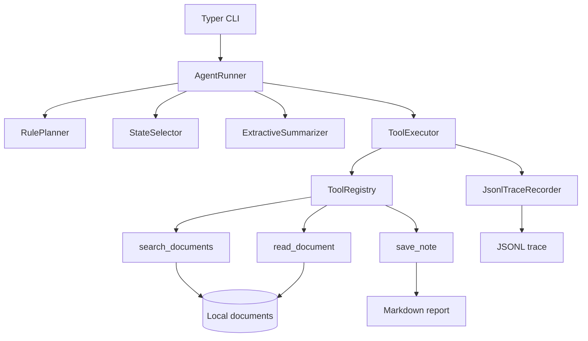

# ResearchFlow Agent

ResearchFlow Agent is an offline, rule-driven agent for technical research over
local documents. It searches and reads local files, produces an extractive
summary, saves a Markdown report, and records parseable execution traces. The
project focuses on explicit tool calls, validated state, filesystem safety, and a
bounded execution loop. This first public version uses neither an LLM nor a
network service and is not intended to be a production research platform.

## Features

- Fixed rule-based planning and state-driven tool selection
- Bounded, synchronous Agent execution loop
- Deterministic keyword search over local documents
- Strict UTF-8 Markdown and text document reading
- Extractive summaries sourced only from successfully read documents
- Markdown report output
- Pydantic validation for domain models and tool inputs
- Safe-path enforcement for document reads, report writes, and trace files
- Structured tool success and failure results
- One independently parseable JSON object per tool call in JSONL traces
- Direct and one-shot interactive CLI modes
- Optional verbose execution details without full document or note arguments
- Fully offline operation without an API key

## Non-goals

The first version intentionally does not provide:

- LLM reasoning or generation
- Semantic, vector, or BM25 retrieval
- External paper or web search
- Database persistence
- MCP or Agent Skills integration
- Distributed or production deployment
- Conversational memory, multi-turn chat, or multiple agents

## Architecture



One run follows these steps:

1. The CLI accepts a research question and directory options.
2. `RulePlanner` creates the fixed search, read, summarize, and save plan.
3. `StateSelector` chooses the next action from the current Agent state.
4. `ToolExecutor` validates and executes real tool calls and records their traces.
5. `ExtractiveSummarizer` builds a report from successfully read documents only.
6. `save_note` writes the report as Markdown.
7. The Agent stops when it completes, fails, or reaches the configured step limit.

## Requirements

- Python 3.11
- [uv](https://docs.astral.sh/uv/)
- Git for cloning the repository only; Git is not a runtime dependency
- No API key
- No network connection during Agent execution

## Installation

```bash
git clone https://github.com/Primaverah/researchflow-agent.git
cd researchflow-agent
uv sync --frozen
```

## Quick Start

```bash
uv run researchflow run "tool calling"
```

The default configuration is:

```text
documents directory: examples/documents
output directory: output
maximum steps: 10
```

## CLI Usage

Run with a positional research question:

```bash
uv run researchflow run "tool calling"
```

Run once in interactive mode and enter the question at the prompt:

```bash
uv run researchflow run
```

Use all primary options:

```bash
uv run researchflow run "tool calling" \
  --documents-dir examples/documents \
  --output-dir output \
  --max-steps 10 \
  --verbose
```

Inspect the installed CLI:

```bash
uv run researchflow --help
uv run researchflow run --help
uv run researchflow --version
```

Options:

- `--documents-dir`: root directory searched and read by document tools
- `--output-dir`: root directory for reports and traces
- `--max-steps`: positive upper bound on Agent actions; default `10`
- `--verbose/--no-verbose`: show or hide run ID, tool order, status, duration,
  and structured failure details; verbose output is disabled by default

Exit codes:

- `0`: the Agent completed and saved its report
- `1`: the Agent, report save, or another runtime operation failed
- `2`: a command argument, question, or directory configuration was invalid

## Example Run

The exact summary depends on the local documents. A successful run has this
shape; generated identifiers and paths are represented by placeholders:

```text
研究计划
1. [COMPLETED] Search local documents
2. [COMPLETED] Read relevant documents
3. [COMPLETED] Extract and summarize relevant content
4. [COMPLETED] Save the research report

工具状态
[OK] search_documents
[OK] read_document
[OK] save_note

最终摘要
# 研究报告
...

输出文件
报告: <output-directory>/notes/<run_id>.md
Trace: <output-directory>/traces/<run_id>.jsonl
```

## Offline Tools

| Tool | Purpose | Main input | Output |
| --- | --- | --- | --- |
| `search_documents` | Search local `.md` and `.txt` documents | `query`, `limit` | Query, count, and deterministically ordered hits with paths, titles, scores, and snippets |
| `read_document` | Read one allowed UTF-8 document | `path` | Relative path, title, content, and character count |
| `save_note` | Save a UTF-8 Markdown or text research note | `path`, `content`, `overwrite` | Relative saved path and character count |

Pydantic validates every tool input and rejects unknown fields. Document access is
limited to the configured document root, while notes are limited to the output
root. The filesystem backends reject parent traversal, absolute-path escape, and
symbolic-link escape. Existing notes are not silently overwritten when
`overwrite=False`, which is the default.

## Execution Traces

Every completed tool call produces one independently parseable JSON object. The
default trace location is:

```text
output/traces/<run_id>.jsonl
```

Example JSONL record:

```json
{"trace_id":"<trace_id>","run_id":"<run_id>","call_id":"<call_id>","tool_name":"search_documents","arguments":{"query":"tool calling","limit":5},"status":"succeeded","started_at":"2026-01-01T00:00:00Z","duration_ms":1.25,"error_type":null,"error_message":null}
```

Trace arguments are JSON-safe. For `save_note`, the full note body is not written
to the trace; it is replaced by redaction metadata containing its character count.
Trace files contain execution metadata, not Python tracebacks.

## Testing and Quality Checks

Run the test and formatting checks:

```bash
uv run pytest
uv run ruff check .
uv run ruff format --check .
```

Run the complete local acceptance sequence:

```bash
uv sync --frozen
uv lock --check
uv run pytest
uv run ruff check .
uv run ruff format --check .
uv run researchflow --help
uv run researchflow run --help
uv run researchflow --version
```

The repository does not currently claim configured coverage reporting, static type
checking, or CI execution.

## Project Structure

```text
src/researchflow/       Package code for the Agent, tools, and execution layer
tests/                  Unit and offline integration tests
examples/documents/     Small UTF-8 example documents
output/                 Generated reports and traces; ignored by Git
pyproject.toml          Package and tool configuration
uv.lock                 Locked dependencies
```

## Current Limitations

- The research plan is fixed and rule-driven.
- Search is keyword-oriented rather than semantic or generative.
- Summaries are extractive rather than generated.
- Inputs are local UTF-8 Markdown or text documents only.
- Execution is synchronous and single-process.
- There is no LLM, embedding model, database, MCP, or network search.
- There is no conversational memory or multi-turn interaction.

## Roadmap

Possible future work includes:

- BM25 retrieval
- Embedding and vector retrieval
- Optional LLM planners and summarizers
- Database-backed document sources
- Web or academic search tools
- MCP server and client integration
- Reusable Agent Skills
- Evaluation and observability improvements

These items are planned directions, not capabilities of the current version.

## Independent Implementation

> ResearchFlow Agent is an independently implemented educational and portfolio
> project. The source code and example documents in this repository were created
> for this project and do not contain proprietary or restricted project materials.

Third-party dependencies remain subject to their respective licenses.

## License

ResearchFlow Agent is available under the [MIT License](LICENSE).
